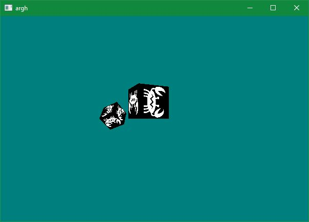

Fomorian is a Haskell library that lets you produce OpenGL graphics by
manipulating a scene graph.

current proof-of-concept data for a simple scene:

```haskell
testScene = pixelOrtho2DView $
              group
              [
                translate2d (V2 0 0)    $ simpleSquare "sad-crab.png",
                translate2d (V2 150 50) $ simpleSquare "owl.png"
              ]
```

This produces the display:


to run the example, make sure stack is installed and:

```
stack build
stack exec exe:example
```
